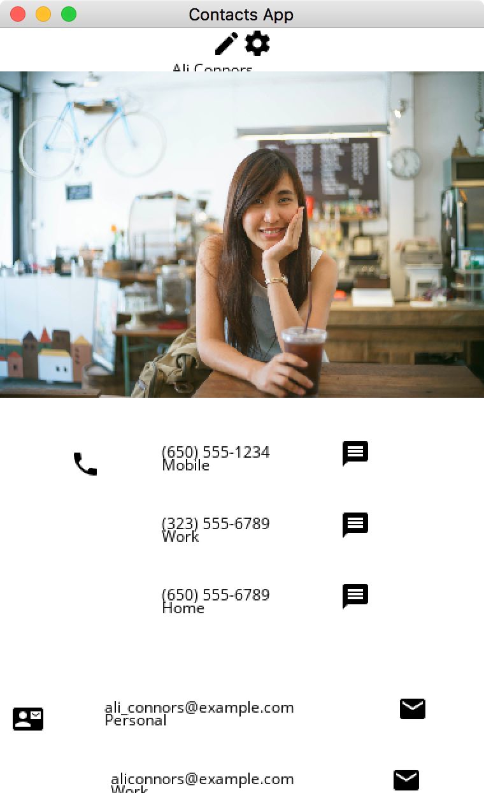

# Squares

_Any UI is really just a collection of overlapping colored squares_


Rewrite of Flutter in Golang.

## Goal

Go needs a UI. Its own UI, written in Go. Not a swig-style auto-generated API that wraps some native widgets written in C and accessed over CGO. You should be able to write the UI and widgets themselves in Go, and create new widgets without leaving the Go language.

## Solution

I enjoy developing mobile apps with Flutter and Dart. I enjoy Flutter's API design, the declarative syntax and the React-style of building widgets and UIs. I also appreciate Flutters internal performant design and common sense approach to optimziation, reflow, layout, and rendering. As a result I don't see a need to design a new UI system from scratch, when there is one that already matches my needs.

I also enjoy programming with Go. While Dart is a fine language, I prefer Go over Dart. And I would like to use Flutter with Go.

To this end, with this project I'm trying to port Flutter to Go.

I also feel the simple style of material design, lends itself well to the feel of Go as a language.

## Adjusting Flutter for Go

Some adjustments do need to be made. Go doesn't have nearly the number of programming language "features". So a number of techniques used in Flutters design are going to have to be translated to Go supported patterns. The goal is not to make Flutter use completely idiomatic Go, though. As some of the readability and simplicity in Flutter comes from its inherit design.

One early decision is to use struct literals instead of constructors when creating widgets and defining a UI. Using struct literals allows us to use named struct fields to better match the declarative style which Flutter is famous for.  Using functions as constructors would take away the ability to name the parameters given to a widget, and also require providing all parameters a widget takes. This declarative style takes the form.

```
Column{
    CrossAxisAlignment: CrossAxisAlignmentCenter,
    MainAxisAlignment:  MainAxisAlignmentCenter,
    Children: []Widget{
        Padding{
            Padding: EdgeInsetsAll(8), 
            Child: Text{Text: "Hello, World."}},
        Text{Text: "another row."},
        Text{Text: "yet another row."},
    },
},
```

## Status

Early alpha. Not really usable. You can create an app, it will render and even scroll. But it has no real visual style, and there are few widgets defined. Even those that are defined have few features implemented.

There is a simple version of composition (rendered widget caching) implemented in the form of a CompositionWidget that you can insert anywhere in the widget tree.

Stateful and Stateless apps work as expected, including using setState to efficiently rebuild the UI.

## Plans

Rather than translating each class or file in full from Dart to Go, I'm just re-implementing the classes one at a time including only minimal features, incrementally buidling up the widgets, and the features they support.

I'm currently working to port over the Contacts Demo from the Flutter Examples. Including all the widgets necessary to make that Demo work.

Rather than trying to copy the L&F of native widgets on any platform, I plan to keep with the Material Design that Flutter already uses. I feel this is actually a good visual style that matches with the feel of working with Go, in general.

## Issues

### Constructors and Default Values

Using default values can't be auto-detected. Leaving out a properties in a struct just results in its Zero-value. And for some properties, the Zero-value might be a valid value for that property. Pointers to such properties could be used, but I think a pointer to an int or float is just bad form.

Within the code I've tried to keep Zero-values matching the standard default values used for each Widget, but thats not always possible. An example is the Flexible widget which defaults its Flex property to 1. A 0 Flex value makes no sense for this widget, so Init() could detect that and return an error when the user leaves this property out. But some widgets have properties where their zero-value is not the default, but at the same time, still a valid value for the property.

Size uses -1 to replicate flutter's use of null for Size dimensions. Constraints can still flow naturally fron 0 to +Inf.

Some widgets take optional Size or Padding arguments for convenience and just create the appropriate widgets on your behalf. I don't replicate that and instead require you to add any SizedBox or Padding widgets yourself. Verbosity is just a fact of life with Go.

## TODO

* SetState should work concurrently via a work-queue
* bugs in Flex so that Expanded and Flexible widgets don't layout correctly
* more widgets and features from Flutter.


## Requirements

* SDL: 
  * `go get github.com/veandco/go-sdl2/sdl`
  * `go get github.com/veandco/go-sdl2/img`

## Screenshot
progress...

